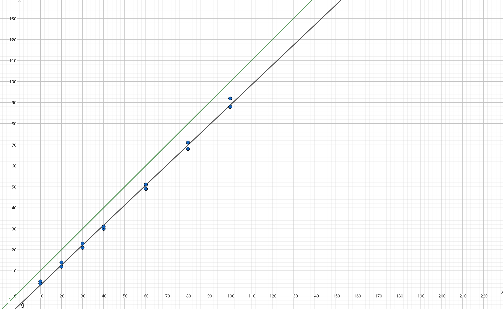
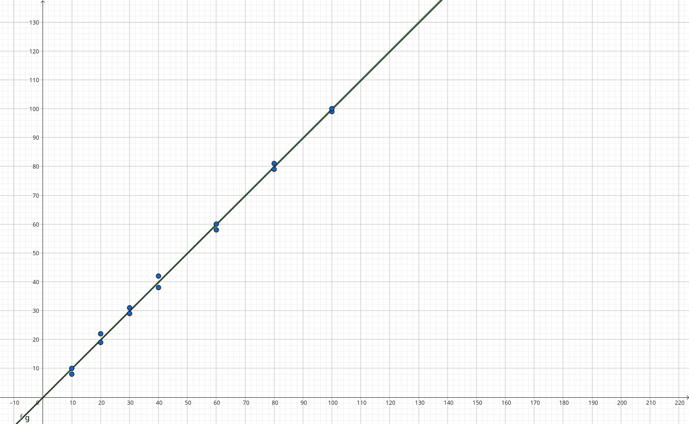
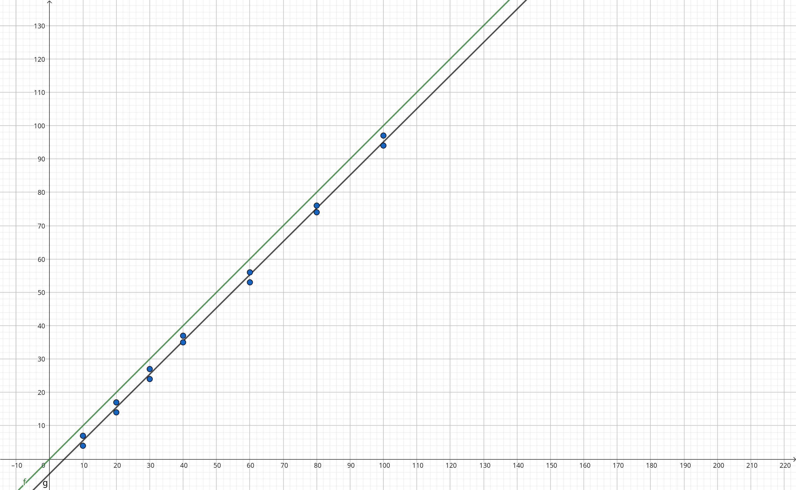
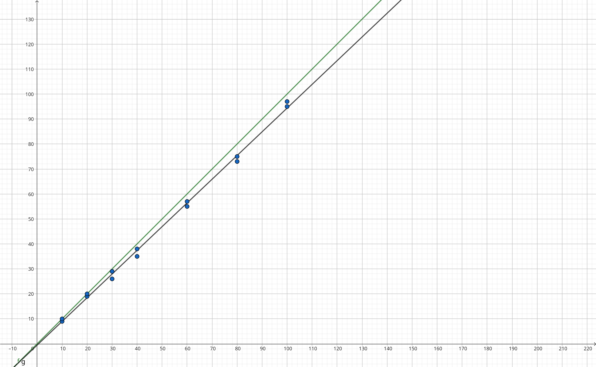

# Picomouse

 <!-- Optional: Add a project logo if needed -->

## Description

A brief description of what this project does and its purpose. 


## Table of Contents
1. [Description](#description)
2. [Mouse Components](#mouse-components)
3. [Mouse Preparation](#mouse-preparation)
4. [Mouse Assembly](#assembling-the-mouse)
5. [Maze](#maze)
6. [Software Overview](#software-overview)
7. [Software Installation](#software-installation)
8. [Sensors calibration](#sensors-calibration)
9. [License](#license)
    


## Mouse Components:
- 2 x N20 600rpm dc brushed motors
- MX1508 motor driver
- 9 volt battery
- ESP-32-vroom 32
- 4 x DFROBOT SEN0427 TOF
- DFROBOT SEN0245 TOF
- DFRobot Gravity I2C BMI160 Gyroscope
- Small Bead size=??????
- M2 screws and bolts 

## Mouse Preparation:
 ### 3d Printing the components:
  The 3d files are in the CAD folder.
  1.Print the base plate: \
  
  2.Print the motors holders: \
   
  3.Print the bead holder (cap): \
   
  4.Print the weels: \
   

  The weels are composed of 2 parts:
  - The inner wheel support printed in hard plastic (PETG/PLA).
  - The rubber is printed with ninjaflex TPU.

## Assembling the Mouse:
  The whole mouse can be build with bolts and screws but threaded insert can be used to disassemble the mouse easily. 

  #### 1.Place and screw the buck convertor: 
    
   


  
 #### 3.Place the motors and fix them with the motors holder: 
   
   

 ####4. Assemble the weels and fix them to the motor axis:
 
    // TODO

 #### 4.Place the battery: 
 
   

 #### 5.Place and screw the TOF's sensors to theire dedicated slot: 
   
   


  #### 6.Place and screw the gyroscope: 
  
   
  
  #### 7.Place and screw the ESP-32 to the back of the motor holder: 
  
   // TODO

  ### Wiring:
    // TODO 
   

## Software Installation
  ### Software Prerequisites:
  
  - Arduino IDE
  - Python 3.10
  - Python libraries: (bleak, pygame)

### Installation:

1. Clone the repository to your local machine:
   ```bash
   git clone https://github.com/epfl-cs358/2024fa-picomouse.git
   cd 2024fa-picomouse
   ```
2. Install python dependecies:
   ```bash
   pip install -r requirements.txt
   ```


## Sensors calibration:
  ### TOF calibration:
  The Tof sensors need to be calibrated individualy, take measure of the sensors at different distances \
  and do a linear regression on the measure given the actual distance. \
  For our sensors we get the following graphs: \
  Where the x axis denotes the real distance and the y axis denotes the measured value. \
  The green line represent the expected slope, and the black line represent the measurements. \

  Left TOF: 
  
  

  Mid Left TOF:

  

  Mid Right TOF:
  
  

  Right TOF

  

  We get 5 slopes: \
  Left_y = 0.951x - 6.273 \
  Mid_Left_y = 0.998x - 0.189 \
  Mid_y = ???? \
  Mid_Right_y = 0.995x - 4.407 \
  Right_y = 0.958x - 1.176 

  The values you will get need to be changed in sensors.h, the SLOPE and OFFSET of each captors. 

  ### Gyroscope calibration:
   The bmi60 chip is knowned for it's natural drift. To counter that the mouse, at initialization, \
   read's GYRO_CALIBRATION_NB_ITERATIONS times the gyroscope and average the values to obtain the offset.\
   The offset itself is not sufficient, we also need an activation treshold to negate small angular speed variation. \
   This parameter needs to be adapted to your gyroscope in gyroscope.h. \
   The gyroscope is also measured ???? times and average it out to mitigate the noise.
   This parameter can also be changed in gyroscope.h.

  

## Improvements:
  1. Reduce the use of floating point calculations in the code using "scaled" fixed point values to improve calculation speed.
  2. Reduce the BLE (bluetooth) library so it can be compiled on the esp and used for the python script.
  3. Use a PCB as the mouse base plate to reduce the weight of the plastic plate and the cable.
  4. Make smooth turns when running the maze (after the exploration phase).
  5. Use a simpler/cheaper gyroscope since we use only the angular speed of the x to y axis.

## License

Copyright (C) 2024 <copyright holders>

Permission is hereby granted, free of charge, to any person obtaining a copy of this software and associated documentation files (the "Software"), to deal in the Software without restriction, including without limitation the rights to use, copy, modify, merge, publish, distribute, sublicense, and/or sell copies of the Software, and to permit persons to whom the Software is furnished to do so, subject to the following conditions:

The above copyright notice and this permission notice shall be included in all copies or substantial portions of the Software.

THE SOFTWARE IS PROVIDED "AS IS", WITHOUT WARRANTY OF ANY KIND, EXPRESS OR IMPLIED, INCLUDING BUT NOT LIMITED TO THE WARRANTIES OF MERCHANTABILITY, FITNESS FOR A PARTICULAR PURPOSE AND NONINFRINGEMENT. IN NO EVENT SHALL THE X CONSORTIUM BE LIABLE FOR ANY CLAIM, DAMAGES OR OTHER LIABILITY, WHETHER IN AN ACTION OF CONTRACT, TORT OR OTHERWISE, ARISING FROM, OUT OF OR IN CONNECTION WITH THE SOFTWARE OR THE USE OR OTHER DEALINGS IN THE SOFTWARE.

Except as contained in this notice, the name of <copyright holders> shall not be used in advertising or otherwise to promote the sale, use or other dealings in this Software without prior written authorization from <copyright holders>.
    
