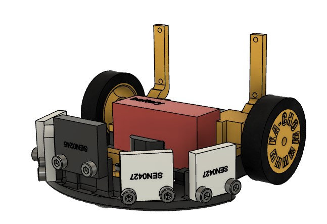

# Picomouse

 <!-- Optional: Add a project logo if needed -->

## Description

A brief description of what this project does and its purpose. 


## Table of Contents
1. [Description](#description)
2. [Mouse Components](#mouse-components)
3. [Mouse Preparation](#mouse-preparation)
4. [Mouse Assembly](#assembling-the-mouse)
5. [Maze](#maze)
6. [Software Overview](#software-overview)
7. [Software Installation](#software-installation)
8. [Sensors calibration](#sensors-calibration)
9. [Distance calculation](#distance-calculation)
10. [License](#license)
    


## Mouse Components:
- 2 x N20 600rpm dc brushed motors
- MX1508 motor driver
- 9 volt battery
- ESP-32-vroom 32
- 4 x DFROBOT SEN0427 TOF
- DFROBOT SEN0245 TOF
- DFRobot Gravity I2C BMI160 Gyroscope
- Small Bead size=??????
- M2 screws and bolts 

## Mouse Preparation:
 ### 3d Printing the components:
  The 3d files are in the CAD folder. \
  We used 10% infill for the printing. \
  1.Print the base plate: 
  
  
  
  2.Print the motors holders: 
  
   
  
  3.Print the bead holder (cap): 
  
   
  
  4.Print the weels: 
  The weels are composed of 2 parts: 
  - The inner wheel support printed in hard plastic (PETG/PLA). 
  - The rubber is printed with ninjaflex TPU. 

  
  

  

## Assembling the Mouse:
  The whole mouse can be build with bolts and screws but threaded insert can be used to disassemble the mouse easily.

  #### 1.Assemble the wheels:
  Glue the rubber on the wheel. \
  Place a M2 hexnut in the dedicated slot.
  
  


  #### 2.Place and screw the buck convertor: 
    
   


  
 #### 3.Place the motors and fix them with the motors holder: 
   
   

 #### 4.Assemble the weels and fix them to the motor axis:
 
    // TODO

 #### 5.Place the battery: 
 
   

 #### 6.Place and screw the TOF's sensors to theire dedicated slot: 
   
   

 #### 7.Place and screw the gyroscope: 
  
   
  
  #### 8.Place and screw the ESP-32 to the back of the motor holder: 
  
   // TODO

  ### Wiring:
    // TODO 
   


## Maze
The competition maze is made by 18cm x 18cm cells with 2cm width walls and 16 cm x 16 cm space inside the cells.
There is also an other maze design that uses 17cm x 17cm cells with 1cm width walls. \
We decided to make the first option to align with the competition design however the second option uses less platic and wood. \
We had the constraint to make a maze that is easily dissmountable thus we used Scratch to attach the walls and the pillars to a carpet. 

### Walls:
Option1. We used 6mm and 8mm thick mdf plates. \
    See the CAD for the dimension of the cut, we used a C02 laser cutter. \
    The wall is composed of 2 plates of 16cm x 5cm and 2 dowel of 2.5cm x 4.5cm that need to be glued together. 

    
 

     

    

Option2. Same as option 1 but with 3mm and 4mm thick mdf plates. \
We get the following wall:

 
    
Using Scratch:

[scratch](images/maze/wall_scratch) 
    

    
### Pillars:
Option1. 3d print the 2cm x 2cm x 5cm pillars \
 
Option2. 3d print the 1cm x 1cm x 5cm pillars \
 
    
Both of them have an option to add a M2 hexnut inside so the pillars can be screwed underneath.\
The bolt can easily be placed using a screwdriver by pushing the bolt until you hear a pop. \
The bolt should be locked in place. \

 

 


    
Using Scratch:
  // TODO get the image of pillar with scratch
    
    

## Software Installation
  ### Software Prerequisites:
  
  - Arduino IDE
  - Python 3.10
  - Python libraries: (bleak, pygame)

### Installation:

1. Clone the repository to your local machine:
   ```bash
   git clone https://github.com/epfl-cs358/2024fa-picomouse.git
   cd 2024fa-picomouse
   ```
2. Install python dependecies:
   ```bash
   pip install -r requirements.txt
   ```


## Sensors calibration:
  ### TOF calibration:
  The Tof sensors need to be calibrated individualy, take measure of the sensors at different distances \
  and do a linear regression on the measure given the actual distance. \
  For our sensors we get the following graphs: \
  Where the x axis denotes the real distance and the y axis denotes the measured value. \
  The green line represent the expected slope, and the black line represent the measurements. \

  Left TOF: 
  
  

  Mid Left TOF:

  

  Mid Right TOF:
  
  

  Right TOF

  

  We get 5 slopes: \
  Left_y = 0.951x - 6.273 \
  Mid_Left_y = 0.998x - 0.189 \
  Mid_y = ???? \
  Mid_Right_y = 0.995x - 4.407 \
  Right_y = 0.958x - 1.176 

  The values you will get need to be changed in sensors.h, the SLOPE and OFFSET of each captors. 

  ### Gyroscope calibration:
   The bmi60 chip is knowned for it's natural drift. To counter that the mouse, at initialization, \
   read's GYRO_CALIBRATION_NB_ITERATIONS times the gyroscope and average the values to obtain the offset.\
   The offset itself is not sufficient, we also need an activation treshold to negate small angular speed variation. \
   This parameter needs to be adapted to your gyroscope in gyroscope.h. \
   The gyroscope is also measured ???? times and average it out to mitigate the noise.
   This parameter can also be changed in gyroscope.h.

### Distance Calculation:
Using the TOF sensors we can estimate the mouse position to a left or right wall.
We can get the mouse orientation and its distance to the wall (from the center of the mouse).


$$
    \begin{aligned}
    \text{Given: } \ & \alpha_1 , \ c_1 , \ \beta_1, \ r \\
    \text{To be found: } \ & d, \ \theta_1 \\
    \newline
    d &= \sqrt{r^2 + c_1^2 - 2 \cdot r \cdot c_1 \cdot \cos(\pi - \beta_1)} \\
    \theta_1 &= \alpha_1 + \arccos\left(\frac{d^2 + c_1^2 - r^2}{2 \cdot d \cdot c_1}\right) \\
    \end{aligned}
$$


$$
    \begin{aligned}
    \text{Given: } \ & d_1, \ \theta_1, \ d_2, \ \theta_2 \\
    \text{To be found: } \ & d_3, \ d_5, \ d_6 \\
    \newline
    d_3 &= \sqrt{d_1^2 + d_2^2 - 2 \cdot d_1 \cdot d_2 \cdot \cos(\theta_1 - \theta_2)} \\
    d_5 &= \frac{d_2^2 + d_3^2 - d_1^2}{2 \cdot d_3} \\
    d_6 &= \sqrt{d_2^2 - d_5^2} \\
    \end{aligned}
$$

If you change the sensors disposition you need to changes those values in sensors.cpp.

## UI
The UI made for monitoring the mouse's position and state of the maze stored in the micro-controller is written in Python, using the [Pygame Community Edition library](https://github.com/pygame-community/pygame-ce). 
To use the provided code, you'll need to install pygame-ce (``pip install pygame-ce``) which should already be done if you installed the requirements.

### How to use
#### Bluetooth
If your micromouse is connected to the bluetooth //TODO
#### Standalone
If you are simply trying to visualize the maze and play with it offline, you'll have to understand how it is interpreted by the code. Every cell is represented by a set of 4 bits. Each of these bits represents a wall. In order, the first bit represents the left wall, the second, the upper wall, the third, the right wall, the fourth, the bottom wall (i.e. 0b1010 represents a cell with a wall on the left and wall on the right).
##### Example of a complete maze
```
maze = [[0b0000, 0b0101, 0b0110, 0b1000, 0b0000, 0b0000, 0b0000, 0b0000],
        [0b1010, 0b1111, 0b1011, 0b1000, 0b0000, 0b0001, 0b0000, 0b0000],
        [0b1001, 0b0110, 0b1101, 0b0000, 0b0011, 0b1110, 0b1001, 0b0000],
        [0b0110, 0b1001, 0b0110, 0b1011, 0b1110, 0b1010, 0b1111, 0b1000],
        [0b0000, 0b0110, 0b1001, 0b0101, 0b0001, 0b0010, 0b1101, 0b0000],
        [0b0000, 0b0000, 0b0100, 0b0100, 0b0110, 0b1001, 0b0110, 0b0000],
        [0b0000, 0b0000, 0b0000, 0b0000, 0b0000, 0b0100, 0b0000, 0b0000],
        [0b0000, 0b0000, 0b0000, 0b0000, 0b0000, 0b0000, 0b0000, 0b0000]]
```
This represents the following maze :


## Improvements:
  1. Reduce the use of floating point calculations in the code using "scaled" fixed point values to improve calculation speed.
  2. Reduce the BLE (bluetooth) library so it can be compiled on the esp and used for the python script.
  3. Use a PCB as the mouse base plate to reduce the weight of the plastic plate and the cable.
  4. Make smooth turns when running the maze (after the exploration phase).
  5. Use a simpler/cheaper gyroscope since we use only the angular speed of the x to y axis.

## License

Copyright (C) 2024 <copyright holders>

Permission is hereby granted, free of charge, to any person obtaining a copy of this software and associated documentation files (the "Software"), to deal in the Software without restriction, including without limitation the rights to use, copy, modify, merge, publish, distribute, sublicense, and/or sell copies of the Software, and to permit persons to whom the Software is furnished to do so, subject to the following conditions:

The above copyright notice and this permission notice shall be included in all copies or substantial portions of the Software.

THE SOFTWARE IS PROVIDED "AS IS", WITHOUT WARRANTY OF ANY KIND, EXPRESS OR IMPLIED, INCLUDING BUT NOT LIMITED TO THE WARRANTIES OF MERCHANTABILITY, FITNESS FOR A PARTICULAR PURPOSE AND NONINFRINGEMENT. IN NO EVENT SHALL THE X CONSORTIUM BE LIABLE FOR ANY CLAIM, DAMAGES OR OTHER LIABILITY, WHETHER IN AN ACTION OF CONTRACT, TORT OR OTHERWISE, ARISING FROM, OUT OF OR IN CONNECTION WITH THE SOFTWARE OR THE USE OR OTHER DEALINGS IN THE SOFTWARE.

Except as contained in this notice, the name of <copyright holders> shall not be used in advertising or otherwise to promote the sale, use or other dealings in this Software without prior written authorization from <copyright holders>.
    
